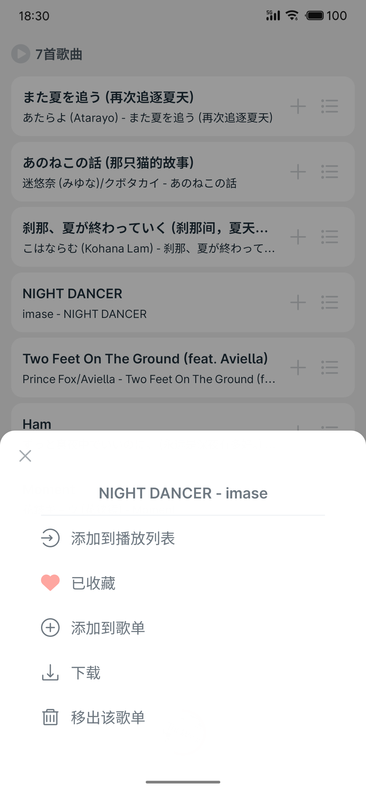
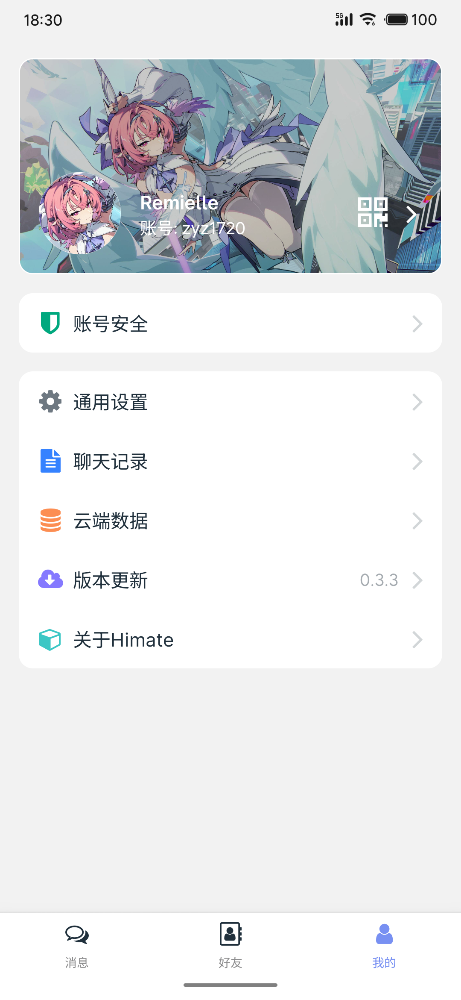
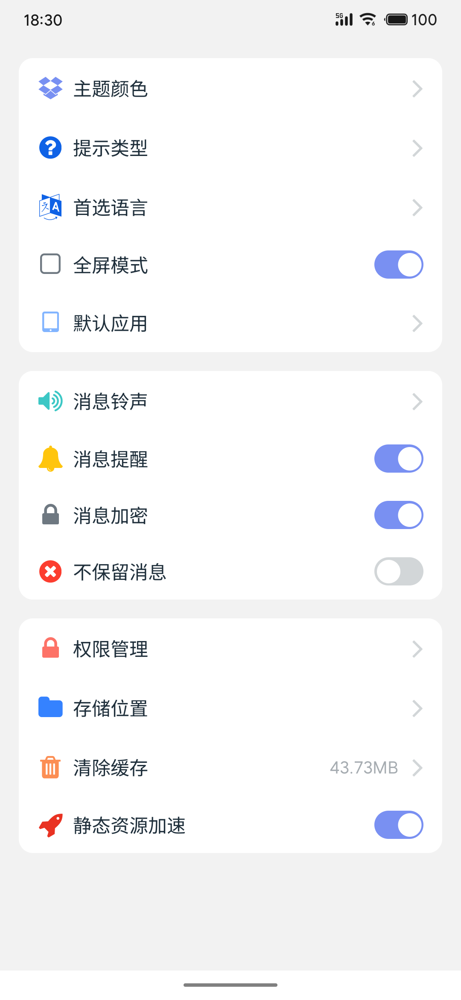
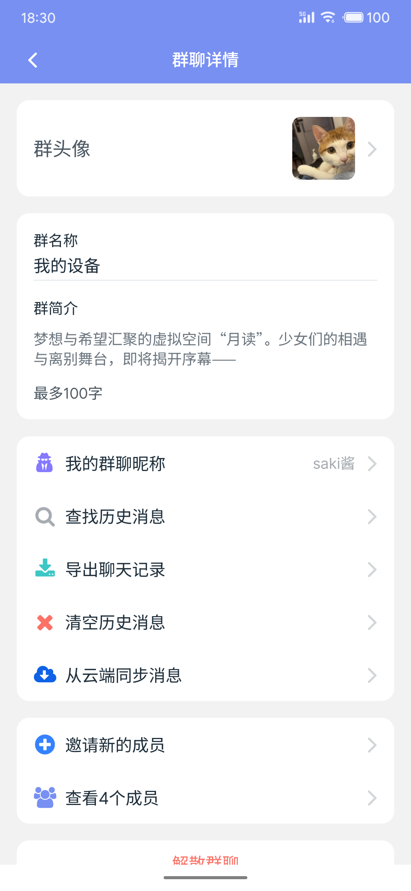

<a href="./README.EN.md" >English</a> | <a href="./README.md" >简体中文</a>

# Himate


## 项目简介

Himate是一款基于React Native 0.75.5开发的轻量级聊天和音乐移动应用。

### 项目截图

<table style="border:none">
  <tr>
    <td></td>
    <td></td>
    <td></td>
    <td></td>
  </tr>
  <tr>
    <td></td>
    <td></td>
    <td></td>
    <td></td>
  </tr>
</table>


## 功能特点

### 📱 聊天功能
- 实时消息通信
- 支持文字、图片、音频、视频等多种消息类型
- 会话管理与历史记录
- 群聊功能
- 消息搜索与管理

### 🎵 音乐功能
- 本地音乐播放
- 音乐收藏与分类
- 歌词显示与控制
- 最近播放记录
- 悬浮歌词功能
- 音乐搜索

### 🌍 国际化
- 支持中文和英文多语言切换
- 自适应系统语言

### 🎨 用户体验
- 流畅的动画效果
- 响应式设计
- 直观的用户界面
- 实时通知

## 技术栈

### 核心框架
- **React Native**: 0.75.5
- **React**: 18.3.1

### 导航与路由
- **React Navigation**: 6.x
  - Stack Navigator
  - Tab Navigator
  - Drawer Navigator

### 状态管理
- **Zustand**: 5.x

### 数据库
- **Realm**: 12.x

### 国际化
- **i18next**: 25.x
- **react-i18next**: 16.x

### 聊天功能
- **react-native-gifted-chat**: 2.6.5
- **socket.io-client**: 4.7.5

### 音乐功能
- **react-native-audio-recorder-player**: 3.6.12
- **react-native-music-control**: 1.4.1

### UI组件
- **react-native-ui-lib**: 7.x
- **react-native-vector-icons**: 10.x

### 网络与API
- **axios**: 1.6.x
- **react-native-sse**: 1.x

### 工具库
- **dayjs**: 1.11.x
- **pinyin-pro**: 3.x
- **@react-native-async-storage/async-storage**: 2.x

## 安装与设置

### 环境要求
- Node.js: >= 18.x
- npm/yarn: 最新版本
- React Native CLI: 最新版本
- Android Studio/Xcode: 用于原生开发
- Java Development Kit (JDK): >= 11.x

### 安装步骤

1. **安装依赖**
   ```bash
   yarn
   ```

2. **配置环境变量**
   - 文件为 `.env`
   - 根据需要修改环境变量

3. **运行脚本替换包**（如果需要）
   - react-native-audio-recorder-player: 优化网络卡顿时加载音乐导致的UI极其卡顿的问题。
   - react-native-music-control: 增加flyme状态栏歌词，优化对Android14的支持。
   ```bash
   node scripts/replace-packages.js
   ```

## 运行应用

### Android
```bash
# 或使用yarn
yarn android
```

### iOS
```bash
# 或使用yarn
yarn ios
```

### 启动Metro服务器
```bash
# 默认启动
npm start

# 清除缓存后启动
npm run start:clean

# 开发环境启动
npm run start:dev

# 生产环境启动
npm run start:prod
```

## 构建应用

### Android
```bash
# 生成Release APK
cd android
./gradlew assembleRelease

# 生成Debug APK
./gradlew assembleDebug
```

### iOS
使用Xcode打开项目，配置好签名证书后，点击Xcode菜单中的“Product” -> “Archive”，Xcode会自动构建并归档应用。

## 项目结构

```
himate/
├── __tests__/           # 测试文件
├── android/             # Android原生代码
├── ios/                 # iOS原生代码
├── packages/            # 自定义包
├── public/              # 静态资源
│   └── screenshot/      # 项目截图
├── scripts/             # 脚本文件
├── src/                 # 源代码
│   ├── api/             # API请求
│   ├── assets/          # 资源文件
│   ├── components/      # 组件
│   ├── config/          # 配置
│   ├── constants/       # 常量
│   ├── i18n/            # 国际化
│   ├── pages/           # 页面
│   ├── router/          # 路由
│   ├── stores/          # 状态管理
│   └── utils/           # 工具函数
├── App.jsx              # 应用入口
├── index.js             # 项目入口
├── package.json         # 项目配置
└── README.md            # 项目说明
```

## 核心模块说明

### 聊天模块
- **聊天页面**: `src/pages/message/msg_pages/chat.jsx`
- **消息存储**: 使用Realm数据库存储聊天记录
- **实时通信**: 通过Socket.io实现实时消息，使用Server-Sent Events (SSE) 实现消息推送

### 音乐模块
- **音乐控制器**: `src/components/music/MusicController.jsx`

## 许可证

本项目采用MIT许可证 - 查看[LICENSE](LICENSE)文件了解详情

### 关联项目
- **后端**: [Himate NestJS Server](https://gitee.com/zyz1720/himate_server_nest)
- **后台管理**: [Himate React Backend](https://gitee.com/zyz1720/himate_backend_react)